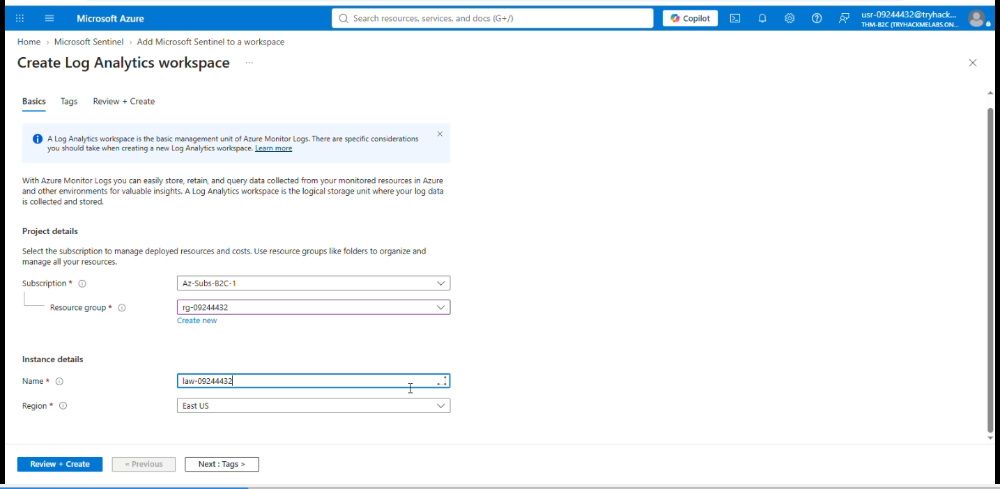
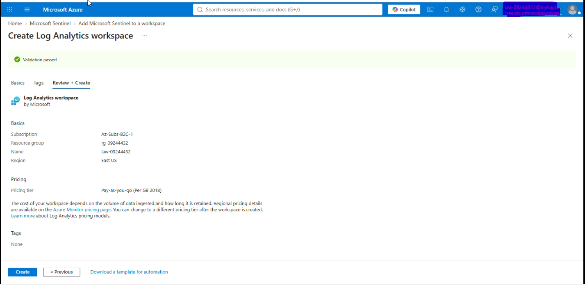
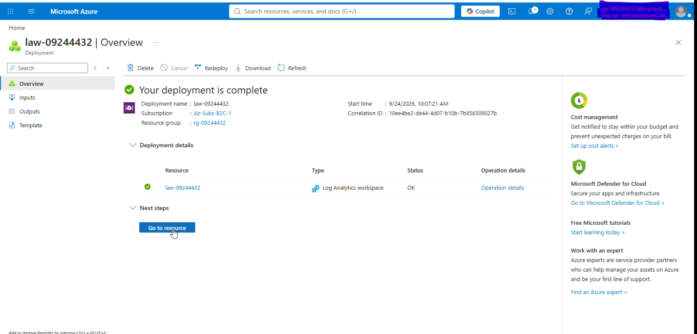
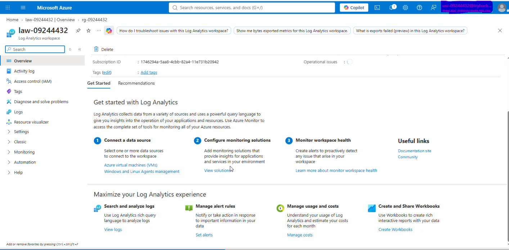
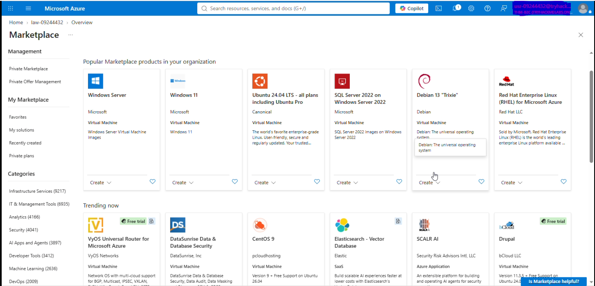

# Environment Setup - Deployment

## Objective

Establish the Azure resources required for the Microsoft Sentinel lab.

## Actions Performed

### 1. Resource Group - Create Resource Group

* Resource group name:
* Azure region:
* Purpose:



### 2. Log Analytics Workspace - Create & Configure LAW

* Workspace name:
* Region:
* Resource group:
* Purpose:



### 3. Deployment Complete

The Azure resources required for the Sentinel environment were deployed and the environment was ready for validation.



### 4. Microsoft Sentinel

* Sentinel workspace:
* Configuration status:
* Verification performed:




## Validation

* [ ] Resource group created
* [ ] Log Analytics workspace created
* [ ] Sentinel enabled
* [ ] Sentinel workspace accessible
* [ ] Screenshots captured



## Observations

Record anything operationally relevant here, such as:

* Configuration decisions
* Portal behavior
* Permissions encountered
* Errors and how they were resolved
* Unexpected behavior
* Relevant Azure dependencies

## Result

```text
Azure Resource Group
        ↓
Log Analytics Workspace
        ↓
Microsoft Sentinel
        ↓
Ready for security telemetry
```
