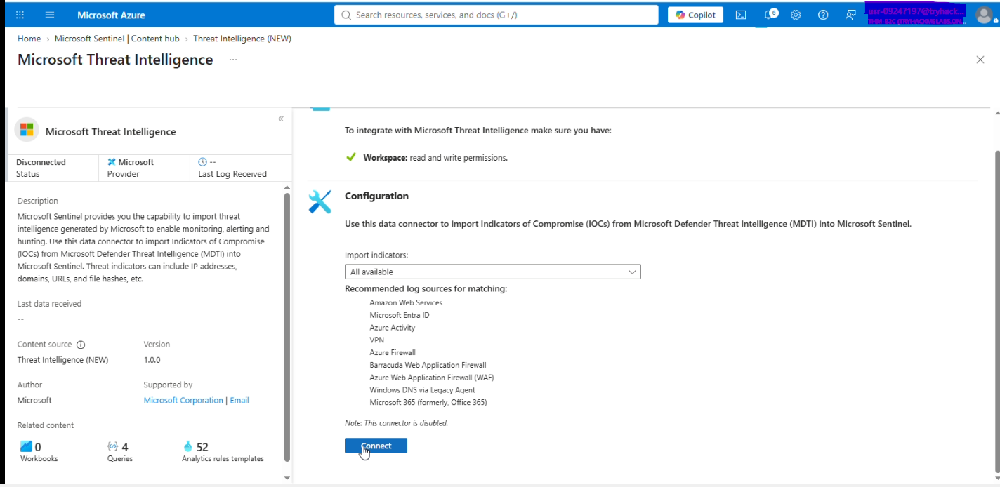
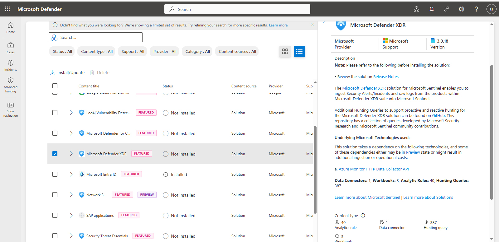

# Microsoft Sentinel — Data Connectors

## Objective

Connect security data sources to Microsoft Sentinel and verify telemetry ingestion.

## 1. Microsoft Entra ID

### Configuration

```text
Microsoft Sentinel
→ Content Hub
→ Microsoft Entra ID
→ Install Solution
→ Data Connectors
→ Microsoft Entra ID
→ Configure
```

* **Purpose:** Identity and authentication monitoring
* **Status:** Connected


## 2. Microsoft Threat Intelligence

### Configuration

```text
Microsoft Sentinel
→ Content Hub
→ Microsoft Threat Intelligence
→ Install Solution
→ Data Connectors
→ Microsoft Threat Intelligence
→ Configure
```

* **Purpose:** Threat intelligence and indicator monitoring
* **Status:** Connected



## 3. Microsoft Defender XDR

### Configuration

```text
Microsoft Sentinel
→ Content Hub
→ Microsoft Defender XDR
→ Install Solution
→ Data Connectors
→ Microsoft Defender XDR
→ Connect
```

* **Purpose:** Endpoint and threat telemetry
* **Status:** Connected



## Validation

* [ ] Entra ID telemetry verified
* [ ] Microsoft Threat Intelligence configured
* [ ] Defender XDR telemetry verified
* [ ] Telemetry verified in Log Analytics

## Architecture

```text
Microsoft Entra ID ───────────────┐
Microsoft Threat Intelligence ────┼──→ Microsoft Sentinel
Microsoft Defender XDR ───────────┘
                                      ↓
                              Log Analytics Workspace
                                      ↓
                                  KQL Queries
```

## Result

Identity, threat-intelligence, and endpoint security telemetry are connected to Microsoft Sentinel and available for investigation.
