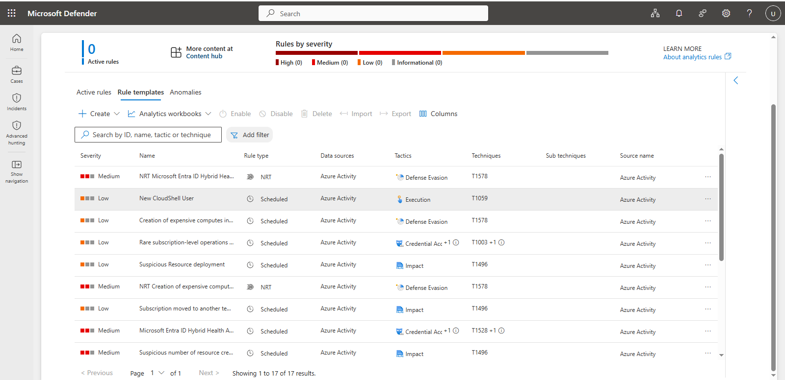
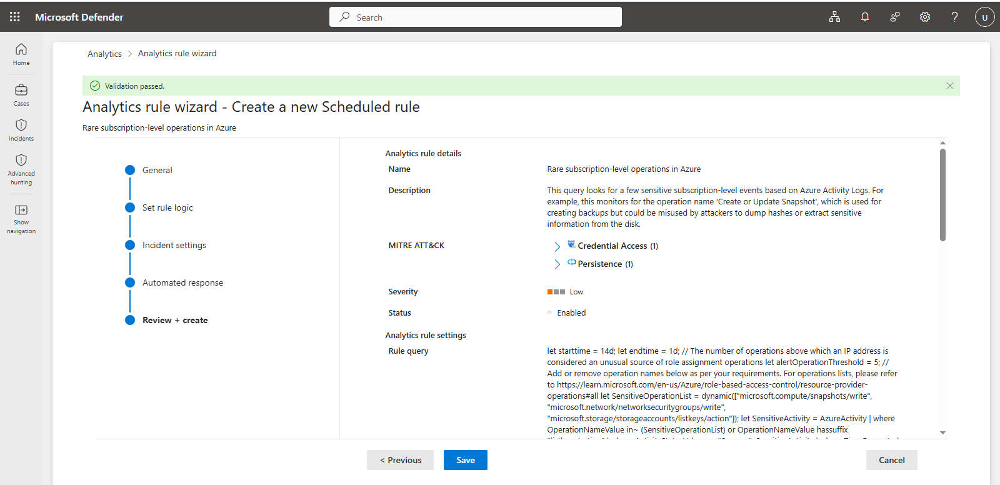

# Microsoft Sentinel — Log Analytics and Analytics Rule

## Objective

Verify security telemetry in the Log Analytics workspace and configure an analytics rule using the available Microsoft Sentinel rule templates.

## 1. Review Analytics Rule Templates

Navigate to:

```text id="q3j1sk"
Microsoft Sentinel
→ Content Hub
→ Azure Activity
→ Install Solution
→ Analytics
→ Rule Templates
```

The **Rule Templates** tab was reviewed to identify available detections for Azure Activity telemetry.



## 2. Configure the Analytics Rule

Navigate to:

```text id="4y5f3c"
Microsoft Sentinel
→ Analytics
→ Rule Templates
→ Rare subscription-level operations in Azure
→ Create rule
```

The analytics-rule configuration wizard was used to review the detection configuration, including the rule schedule and query period.

The following settings were reviewed:

* Rule frequency
* Rule period
* Query configuration
* Detection logic
* Incident configuration


## 3. Review the Log Analytics Data

Microsoft Sentinel uses the connected Log Analytics workspace to store and query security telemetry.

The primary tables reviewed for the lab included:

| Data Source             | Table                    |
| ----------------------- | ------------------------ |
| Microsoft Entra ID      | `SigninLogs`             |
| Azure Activity          | `AzureActivity`          |
| Windows Security Events | `SecurityEvent`          |
| Defender XDR            | Defender-specific tables |

The Log Analytics interface was used to validate that telemetry could be queried with KQL.

## 4. Validate the Analytics Rule

After configuring the rule, the active analytics rules were reviewed to confirm that the rule was saved successfully.

The **Rare subscription-level operations in Azure** rule was selected and its configuration was reviewed.



## Validation

### Entra ID

```kql id="q2n1ba"
SigninLogs
| take 10
```

### Azure Activity

```kql id="w5h6sk"
AzureActivity
| take 10
```

### Windows Security Events

```kql id="7v5z5p"
SecurityEvent
| take 10
```

## Configuration Flow

```text id="5w5lby"
Microsoft Sentinel
        ↓
Content Hub
        ↓
Azure Activity Solution
        ↓
Analytics Rule Templates
        ↓
Rare subscription-level operations in Azure
        ↓
Log Analytics
        ↓
KQL Validation
```

## Result

The Azure Activity analytics-rule templates were reviewed, the **Rare subscription-level operations in Azure** rule was configured, and the rule configuration was validated.

Log Analytics telemetry was also verified as the query layer for subsequent KQL investigation and detection engineering.
