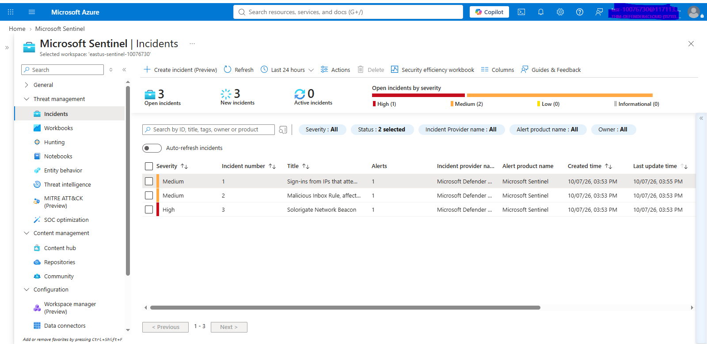
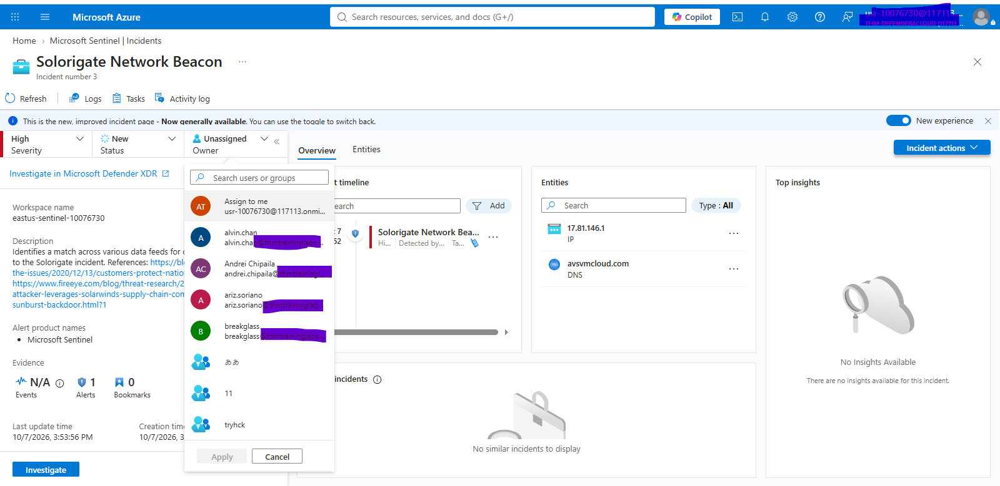
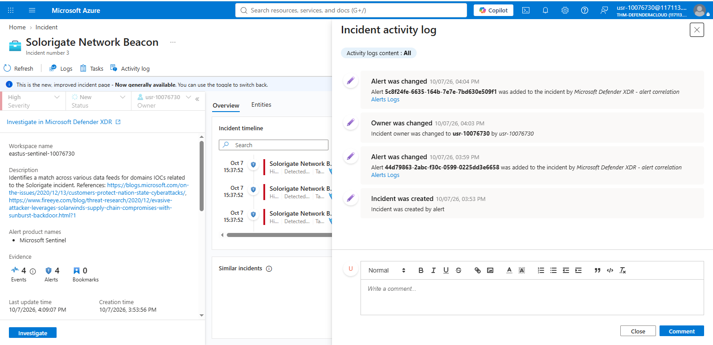
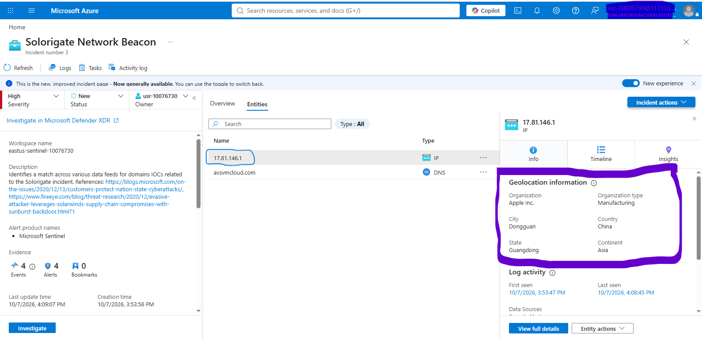
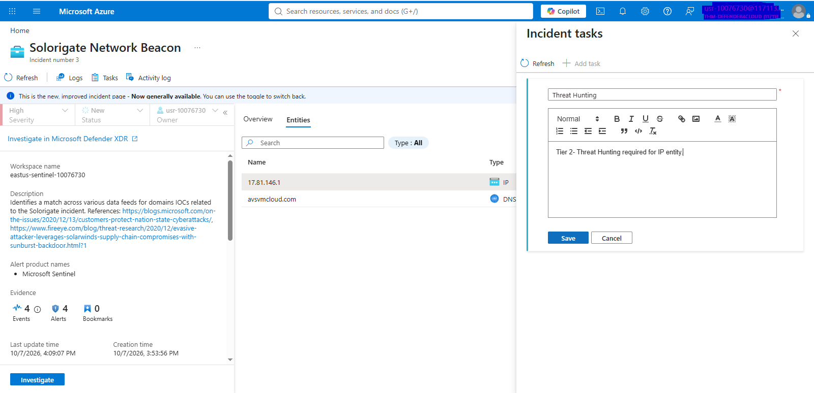
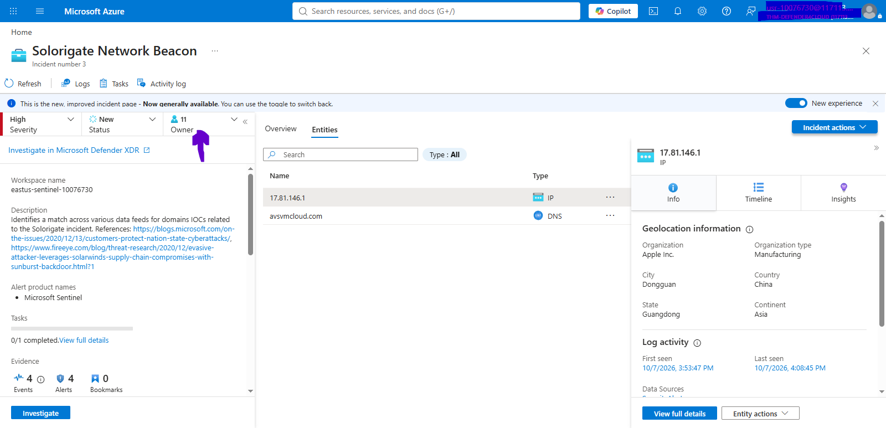

# Microsoft Sentinel — Events, Alerts, Incidents & Investigation

## Objective

Perform Level 1 SOC triage of a Microsoft Sentinel incident, investigate related alerts and entities, and escalate the incident to SOC Level 2.
Step 1: Investigate Incidents - Take Ownership
Go to your Microsoft Sentinel workspace's Incidents page under Threat management.

## 1. Review Incidents

```text
Microsoft Sentinel 
→ Threat management 
→ Incidents 
```

* Review open incidents.
* Select the incident.
* Review severity, status, description, and related alerts.



## 2. Take Ownership

```text
Incident 
→ Assign 
→ Assign to lab user 
→ Status: Active 
```

* Incident assigned to analyst.
* Status changed from `New` to `Active`.



## 3. Investigate Incident

```text
Incident 
→ View full details 
→ Activity log 
→ Incident timeline 
```

Review:

* Incident activity
* Related alerts
* Alert details
* Incident timeline



## 4. Investigate Alert Events

```text
Alert 
→ Link to LA 
→ Logs 
```

Review the underlying event data that triggered the alert.

## 5. Investigate Entities

```text
Incident 
→ Entities 
→ IP Address 
```

Review the IP entity and available contextual information.



## 6. Escalate to SOC Level 2

Create an incident task:

```text
Incident 
→ Incident tasks 
→ Add task 
→ Threat hunting 
→ Save 
```



Then escalate:

```text
Assign 
→ SOC Tier-2 Analysts 
```



## Validation

* [ ] Open incident reviewed
* [ ] Incident assigned to analyst
* [ ] Status changed to Active
* [ ] Activity log reviewed
* [ ] Related alerts reviewed
* [ ] Underlying event data investigated
* [ ] IP entity investigated
* [ ] Threat-hunting task created
* [ ] Incident escalated to SOC Level 2

## Result

```text
Event 
  ↓ 
Alert 
  ↓ 
Incident 
  ↓ 
L1 Triage 
  ↓ 
Investigation 
  ↓ 
Threat-Hunting Task 
  ↓ 
SOC Level 2 Escalation 
```
